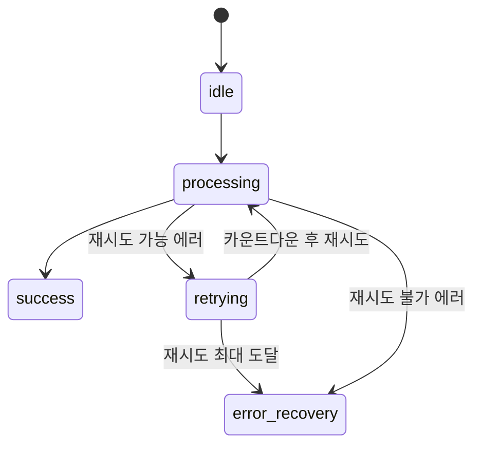
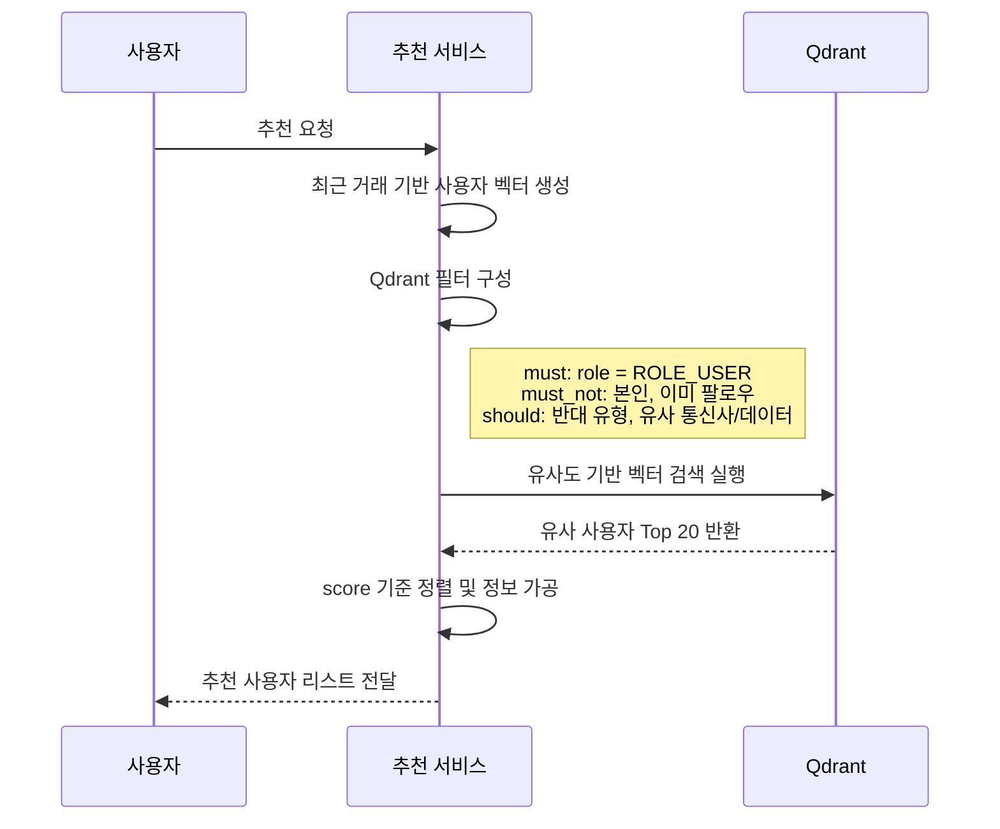
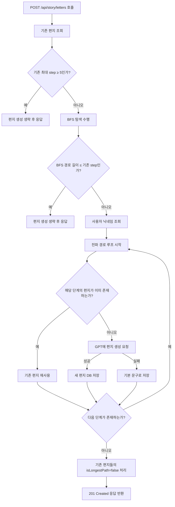

# <div align="center">UFO-Fi</div>


## <div align="center">서비스 소개</div>

<div align="center">

<p>
<strong>데이터는 부족해도, 은하는 연결되어 있다 🌌</strong>
</p>

<p>
지금 지구는요…<br>
남는 데이터는 매달 <strong>소멸</strong>되고,<br>
부족할 땐 <strong>비싼 요금</strong>으로 충전하며,<br>
비공식 거래는 <strong>불안과 위험</strong>을 안고 있습니다.
</p>

<p>
그래서 등장했습니다 – <strong>UFO-Fi 🛸</strong>
</p>

<p>
👽 <strong>외계에서 온 신뢰의 데이터 중개사, 유포파이</strong>는<br>
여러분의 데이터를 <strong>안전하게 보관</strong>하고,<br>
필요한 사람에게 <strong>간편하고 신뢰 있게 연결</strong>해줍니다.
</p>

</div>

## 프로젝트 개요

| 항목           | 내용                             |
| -------------- | -------------------------------- |
| **프로젝트명** | UFO-Fi                           |
| **팀명**       | AL1EN                            |
| **주제**       | 무선 데이터 공유 플랫폼          |
| **타겟층**     | 데이터 구매 수요 및 공급층       |
| **개발 기간**  | 2025.06.30 ~ 2025.08.07 (약 5주) |

## 프로젝트 배경

### 시장 분석

- **유휴 데이터의 구조적 소멸**
  - 무제한 요금제 확산으로 과잉 제공된 데이터의 자동 소멸 현상

- **비공식 거래의 신뢰성 문제**
  - 중고 커뮤니티 기반 거래의 사기 위험성과 법적 보호의 부재

- **공식 유통 채널의 부재**
  - 통신사 데이터 선물 기능의 낮은 사용성과 거래 수단으로서의 한계

### 개발 동기

- **데이터 유통 구조 설계의 필요성**
  - 소멸되는 데이터를 유통 가능한 자산으로 전환하기 위한 구조적 해결책의 필요

- **신뢰 기반 개인 간 거래 환경 조성**
  - 안전하고 공식적인 거래 구조를 통한 사용자 참여 유도

## 프론트엔드 기술 스택


## **주요 기능**

| 항목 | 사진 | 내용 |
|--------|------------|--------|
| **회원 인증 및 사용자 시스템** | <div align="center"></div> | **Kakao OAuth2 소셜 로그인**<br>OAuth2 인증 후 자체 JWT + Refresh Token 발급<br><br>**요금제 자동 등록**<br>명세서 OCR 분석<br><br>**마이페이지**<br>요금제·계좌 관리, 거래 내역, 업적 시스템 제공 |
| **ZET 충전 및 PG 결제 시스템** | <div align="center"></div> | **ZET(Zero Expired Traffic)**<br>내부 재화 (1ZET = 10원)<br><br>**Toss Payments** 연동 → 실시간 카드 결제 및 ZET 충전<br><br>**충전 상태 FSM 관리**<br>(요청 → 대기 → 성공/실패)<br><br>**보안 강화 + 예외 처리 UX 반영** |
| **데이터 거래 시스템 (수탁형 구조)** | <div align="center"></div> | **판매자**<br>통신사·용량·가격 입력 후 데이터 등록<br><br>**구매자**<br>전화번호 입력 → 플랫폼이 대신 전송 _(통신사 선물 기능 활용)_<br>판매 시점 잔여량 자동 차감 + ZET 자동 정산<br><br>**3단계 UI**<br>데이터 등록 → 구매 요청 → 수령 확인<br><br>**일괄구매 기능**<br>예산/용량 기반 최적 조합 탐색 + 일부 구매 가능 |
| **운영 모니터링 및 관리자 백오피스** | <div align="center"></div> | **Slack Webhook 연동**<br>결제 실패, 트래픽 급증 자동 알림<br><br>**신고/제재 시스템**<br>자동 누적 차단 + 관리자 수동 처리<br><br>**금칙어 관리**<br>아호코라식 필터링, 사용자 정지/해제, ZET 복구 기능 포함<br><br>**운영 대시보드**<br>사용자/게시글/거래/신고 통계 실시간 시각화 |
| **신뢰 기반 사용자 참여 시스템** | <div align="center"></div> | **팔로우 추천 시스템**<br>Qdrant 기반 유사·보완 사용자 자동 매칭<br><br>**FCM 푸시 알림**<br>거래 성사, 신고 결과 등 실시간 알림 제공<br><br>**전파 거리 시각화**<br>BFS 기반으로 판매자 ↔ 구매자 연결 깊이 최대 5단계 추적<br><br>**우주 편지 생성**<br>전파 단계마다 AI 편지 생성 및 업적 달성 보상 |

## 프로젝트 실행 방법

```bash
npm i
npm run build
npm run dev
```

## Code Convention

- [Git Convention](https://github.com/Ureca-Final-Project-Team1/UFO-Fi-FE/wiki/Git-Convention)
- [FE Code Convention](https://github.com/Ureca-Final-Project-Team1/UFO-Fi-FE/wiki/%ED%94%84%EB%A1%A0%ED%8A%B8%EC%97%94%EB%93%9C-Code-Convention)

## 우리가 한 것

## FSM 기반 결제 재시도 시스템 모델링

> 다양한 실패 원인을 상태 흐름으로 제어하고, 사용자에게 정확한 안내 제공

### 핵심 설계

- **에러 분류**: `classifyError()`로 재시도 가능 여부 자동 판단
- **상태 전이**: `RetryState` 기반 유한 상태머신 모델링
- **로직 분리**: `usePurchaseRetry()` 훅으로 결제 흐름 추상화
- **UI 대응**: 실패 유형별 맞춤 메시지 + 복구 버튼 제공

### RetryState 상태 전이 다이어그램



### 에러 분류 기준

| 구분   | 에러 예시                      | 처리 방식            |
| ------ | ------------------------------ | -------------------- |
| 재시도 | `timeout`, `500`, `503` 등     | 최대 3회 자동 재시도 |
| 중단   | `410 Gone`, `잔액 부족`, `404` | 복구 전용 UI 전환    |

### 성과 요약 (도입 전후 비교)

| 지표           | 도입 전 | 도입 후 | 변화        |
| -------------- | ------- | ------- | ----------- |
| 세션 수        | 219     | 379     | +73% 증가   |
| 평균 체류 시간 | 2.3분   | 2.9분   | +26% 증가   |
| 고유 사용자 수 | 64      | 131     | 약 2배 증가 |

### Qdrant 기반 팔로워 추천 시스템

Qdrant + Prisma 기반 벡터 검색으로, 조건 필터링 후 유사 사용자 Top-N 추천



### 전파거리 시각화 및 항해 편지 생성

> 데이터 거래 기록을 BFS 탐색으로 추적하여
> 최대 5단계까지 연결된 유저 간의 여정을 감성적으로 시각화

- BFS 탐색: 구매자 → 판매자 방향의 거래 흐름을 유향 그래프로 구성해 너비 우선 탐색

- 최장 경로 저장: 기존보다 더 긴 전파 경로 발견 시에만 기록하여 중복 및 불필요한 연산 최소화

- GPT 편지 생성: 각 연결 구간마다 AI가 감성 메시지를 생성해 전파 여정을 서사화



### 프로필 공유

> **React-qr-code** + **Web Share API**를 통해
> 사용자의 프로필을 QR 코드 및 소셜 공유로 확산 가능

- **QR 코드 생성**
  - `react-qr-code`를 이용해 현재 프로필 URL을 실시간으로 QR 코드로 변환

- **Web Share API 연동**
  - 모바일 환경에서 카카오톡, 메시지 등으로 URL 공유 지원 (`navigator.share`)

- **Next.js `generateMetadata()`**
  - 각 사용자별로 **동적 메타데이터** 생성 → SNS 미리보기 (OG image, title 등) 최적화

## FE 팀 소개

| 프로필                                                                | 이름                                                       | 주요 역할 및 기여                                                                                                                                               |
| --------------------------------------------------------------------- | ---------------------------------------------------------- | --------------------------------------------------------------------------------------------------------------------------------------------------------------- |
|     | **이영주**<br>[@abyss-s](https://github.com/abyss-s)       | `팀 리드`, `프론트엔드 리드`<br>- 프로젝트 구조 설계 및 전반 총괄<br>- 판매글 등록, 일괄구매, 필터링 기능 구현<br>- FSM 기반 상태관리 도입                      |
|  | **김도건**<br>[@dogeonkim1](https://github.com/dogeonkim1) | `스크럼 리드`, `QA`, `FE`<br>- ZET 충전 및 결제 약관 처리 구현<br>- 관리자 백오피스(신고 해제, 금칙어/사용자 관리)<br>- Storybook 문서 관리                     |
|    | **안민지**<br>[@minji-38](https://github.com/minji-38)     | `기획·디자인 리드`, `FE`<br>- 데이터 구매 프로세스 구현<br>- 전파거리 시각화 및 행성 디자인<br>- 마이페이지(평판, 업적, 팔로우) 개발                            |
|    | **진영호**<br>[@kuru2141](https://github.com/kuru2141)     | `AI 리드`, `FE`<br>- Kakao 소셜 로그인 + JWT 인증 구현<br>- 알림 설정/필터링 페이지, 인증 미들웨어 개발<br>- GPT 기반 사용자 추천 + 전파 스토리텔링 시스템 구현 |

## 프로젝트 산출물

**[서비스 배포](https://www.ufo-fi.store)**
\| **[Storybook 배포](https://686aad151c7964b9495b4f40-hqvfjpyhnx.chromatic.com/?path=/docs/components-bulk-bulkcapacityslider--docs)**
\| **[기획안](https://docs.google.com/document/d/1NqRLayCa4AnSClRW7G0doHbIlRZeVMeL/edit?usp=sharing&ouid=101077923369398316818&rtpof=true&sd=true)**
\| **[WBS](https://docs.google.com/spreadsheets/d/1-bXQZqGRbWhyofkfMdC6lOKrp5KHEylr/edit?usp=sharing&ouid=101077923369398316818&rtpof=true&sd=true)**
\| **[ERD Diagram](https://www.erdcloud.com/d/u8JYmdPAEqxb5cRG3)**
