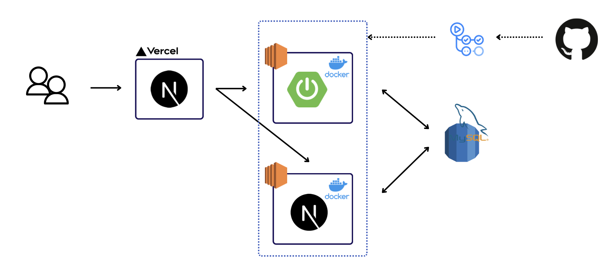
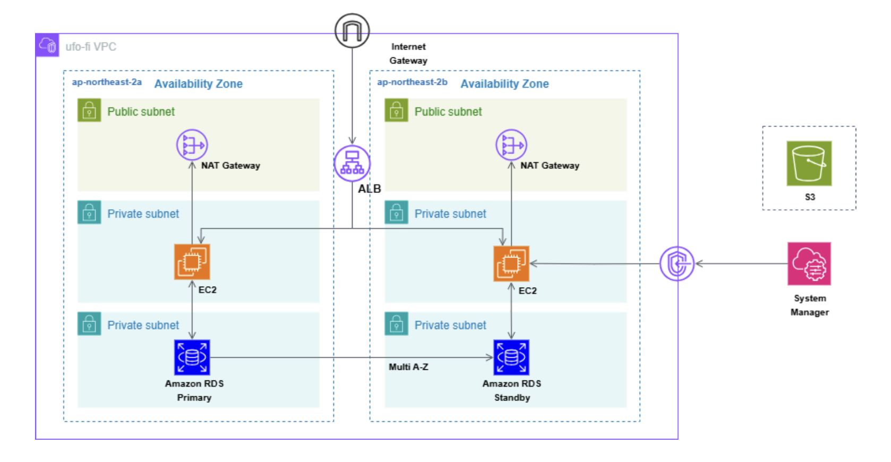
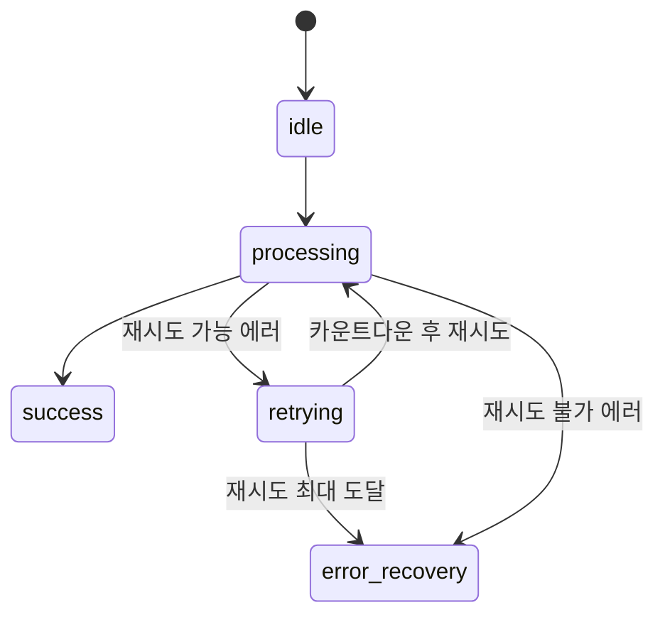
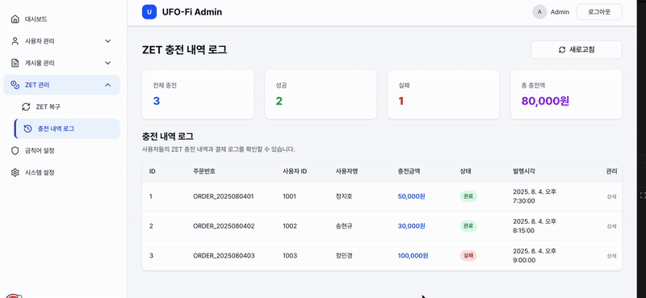
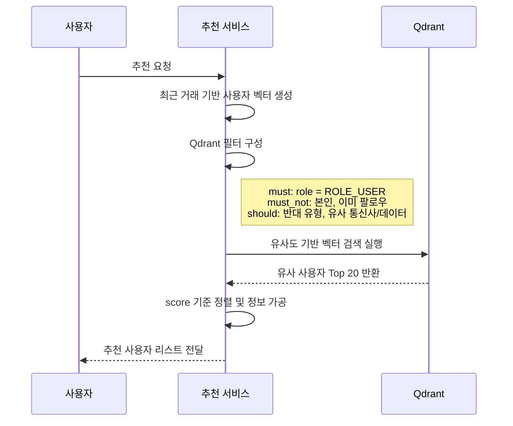
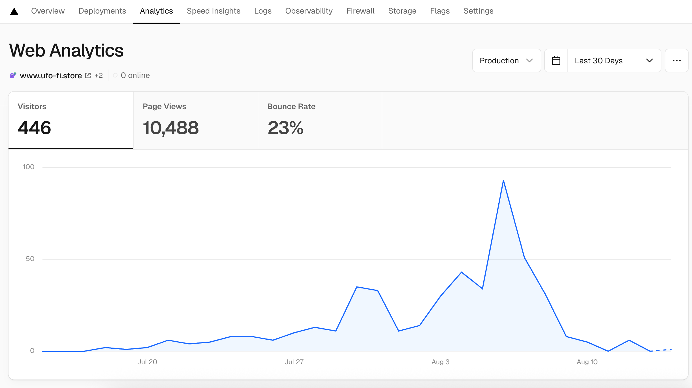

# <div align="center">UFO-Fi</div>

<div align="center">

</div>

## <div align="center">🛸 데이터는 부족해도, 은하는 연결되어 있다</div>

<div align="center">


**수탁 구조 기반 유휴 모바일 데이터 C2C 거래 플랫폼**

[서비스 바로가기](https://www.ufo-fi.store) | [Storybook](https://686aad151c7964b9495b4f40-mjroypvwoa.chromatic.com/?path=/docs/ui-chip--docs) | [기획안](https://docs.google.com/document/d/18lT4sulS8pPTNh95n2JUIQZff5S-SvHB/edit?usp=sharing&ouid=101077923369398316818&rtpof=true&sd=true)

</div>

## 서비스 소개

> **UFO-Fi**는 데이터를 안전하게 보관하고 필요한 사람에게 간편하고 신뢰 있게 연결해주는 거래 플랫폼입니다.

- **문제 인식**
  - **유휴 데이터의 구조적 소멸**: 무제한 요금제 확산으로 과잉 제공된 데이터의 자동 소멸 현상
  - **비공식 거래의 신뢰성 문제**: 중고 커뮤니티 기반 거래의 사기 위험성과 법적 보호의 부재
  - **공식 유통 채널의 부재**: 통신사 데이터 선물 기능의 낮은 사용성과 거래 수단으로서의 한계
- **우리의 해결책**
  - **수탁 구조**를 통해 플랫폼이 제3자로서 데이터와 ZET를 안전하게 중개합니다.

## 프로젝트 개요

| 항목           | 내용                             |
| -------------- | -------------------------------- |
| **프로젝트명** | UFO-Fi                           |
| **팀명**       | AL1EN                            |
| **주제**       | 무선 데이터 공유 플랫폼          |
| **타겟층**     | 데이터 구매 수요 및 공급층       |
| **개발 기간**  | 2025.06.30 ~ 2025.08.07 (약 5주) |

## Code Convention

- [Git Convention](https://github.com/Ureca-Final-Project-Team1/UFO-Fi-FE/wiki/Git-Convention)
- [FE Code Convention](https://github.com/Ureca-Final-Project-Team1/UFO-Fi-FE/wiki/%ED%94%84%EB%A1%A0%ED%8A%B8%EC%97%94%EB%93%9C-Code-Convention)

## Project Architecture

**시스템 아키텍처**



**인프라 아키텍처**



## 기술 스택 및 선택 이유

### Frontend

| 기술                                                                                                                                                                                                                    | 적용 맥락                                  | 주요 도입 이유                                                                                                                       |
| ----------------------------------------------------------------------------------------------------------------------------------------------------------------------------------------------------------------------- | ------------------------------------------ | ------------------------------------------------------------------------------------------------------------------------------------ |
|                                                                                                              | 전체 페이지 구성 및 App Router 기반 라우팅 | •**SEO 최적화**: ;데이터 거래' 키워드 상위 노출로 자연스러운 사용자 유입<br>• **사용자 경험 최적화**: 빠른 초기 진입으로 이탈률 감소 |
|                                                                                                        | 컴포넌트 간 props, API 응답 등 타입 관리   | • 명시적 타입으로 런타임 오류 방지<br>• 복잡한 구조의 안정성 확보                                                                    |
|                                                                                                  | UI 전체 스타일링 및 반응형 구성            | • 빠른 화면 구현<br>• 반응형 대응 용이                                                                                               |
|                                                                                                                 | 인증 상태 등 글로벌 상태 관리              | • 가볍고 러닝커브가 적음 <br>• 로직 분리와 테스트 용이                                                                               |
|   | 서버 연동 데이터 패칭                      | • 요청 추상화 및 캐싱 제공<br>• 로딩/에러 자동 처리                                                                                  |
|                                                                                                            | 탭, 모달 등 재사용 UI 구성                 | • 접근성 높은 기본 컴포넌트 제공<br>• MVP 단계에서 빠른 개발 생산성                                                                  |
|                                                                                                           | 컴포넌트 설계 및 시각적 테스트             | • 독립된 UI 테스트 환경<br>• 반복 확인 및 공유 효율화                                                                                |
|                    | 코드 스타일 검증 및 커밋 전 자동 점검      | • 일관된 코드 스타일 유지<br>• 협업 중 실수 방지                                                                                     |

### Backend & Data Layer

| 기술                                                                                                  | 적용 맥락                      | 주요 도입 이유                                                                                                     |
| ----------------------------------------------------------------------------------------------------- | ------------------------------ | ------------------------------------------------------------------------------------------------------------------ |
|  | ORM & 데이터베이스 스키마 관리 | • 마이그레이션 자동화 및 DB 스키마 일관성 유지<br>• API 이원화(Next.js·Spring Boot) 환경에서도 공용 모델 관리 용이 |
|  | 벡터 데이터베이스(추천/검색)   | • 고성능 벡터 검색으로 사용자 추천·매칭 기능 구현<br>• 대규모 임베딩 데이터 처리 최적화                            |

### Collaboration & Project Management

| 기술                                                                                                     | 적용 맥락                     | 주요 도입 이유                                                                      |
| -------------------------------------------------------------------------------------------------------- | ----------------------------- | ----------------------------------------------------------------------------------- |
|     | 코드 버전 관리 및 협업 플랫폼 | • Git Flow 기반 브랜치 전략<br>• PR 기반 코드 리뷰<br>• GitHub Actions CI/CD 자동화 |
|           | 이슈 추적 및 스프린트 관리    | • 스크럼 방법론 적용<br>• 백로그 및 스프린트 계획                                   |
|     | 프로젝트 문서화 및 지식 공유  | • 회의록 및 개발 가이드<br>• 팀 내 정보 중앙화                                      |
|  | REST API 문서화 및 테스트     | • 백엔드 API 자동 문서화<br>• API 테스트 환경 제공                                  |

## **주요 기능**

| 항목                                 | 사진                                                                                                                                                            | 내용                                                                                                                                                                                                                                                                                                                     |
| ------------------------------------ | --------------------------------------------------------------------------------------------------------------------------------------------------------------- | ------------------------------------------------------------------------------------------------------------------------------------------------------------------------------------------------------------------------------------------------------------------------------------------------------------------------ |
| **회원 인증 및 사용자 시스템**       | <div align="center"></div>                 | **Kakao OAuth2 소셜 로그인**<br>OAuth2 인증 후 자체 JWT + Refresh Token 발급<br><br>**요금제 자동 등록**<br>명세서 OCR 분석<br><br>**마이페이지**<br>요금제·계좌 관리, 거래 내역, 업적 시스템 제공                                                                                                                       |
| **ZET 충전 및 PG 결제 시스템**       | <div align="center"></div> | **ZET(Zero Expired Traffic)**<br>내부 재화 (1ZET = 10원)<br><br>**Toss Payments** 연동 → 실시간 카드 결제 및 ZET 충전<br><br>**충전 상태 FSM 관리**<br>(요청 → 대기 → 성공/실패)<br><br>**보안 강화 + 예외 처리 UX 반영**                                                                                                |
| **데이터 거래 시스템 (수탁형 구조)** | <div align="center"></div> | **판매자**<br>통신사·용량·가격 입력 후 데이터 등록<br><br>**구매자**<br>전화번호 입력 → 플랫폼이 대신 전송 _(통신사 선물 기능 활용)_<br>판매 시점 잔여량 자동 차감 + ZET 자동 정산<br><br>**3단계 UI**<br>데이터 등록 → 구매 요청 → 수령 확인<br><br>**일괄구매 기능**<br>예산/용량 기반 최적 조합 탐색 + 일부 구매 가능 |
| **운영 모니터링 및 관리자 백오피스** | <div align="center"></div>                 | **Slack Webhook 연동**<br>결제 실패, 트래픽 급증 자동 알림<br><br>**신고/제재 시스템**<br>자동 누적 차단 + 관리자 수동 처리<br><br>**금칙어 관리**<br>아호코라식 필터링, 사용자 정지/해제, ZET 복구 기능 포함<br><br>**운영 대시보드**<br>사용자/게시글/거래/신고 통계 실시간 시각화                                     |
| **신뢰 기반 사용자 참여 시스템**     | <div align="center"></div>                 | **팔로우 추천 시스템**<br>Qdrant 기반 유사·보완 사용자 자동 매칭<br><br>**FCM 푸시 알림**<br>거래 성사, 신고 결과 등 실시간 알림 제공<br><br>**전파 거리 시각화**<br>BFS 기반으로 판매자 ↔ 구매자 연결 깊이 최대 5단계 추적<br><br>**우주 편지 생성**<br>전파 단계마다 AI 편지 생성 및 업적 달성 보상                   |

## 주요 기능 및 기술 구현

### 1. 컴포넌트 라이브러리 패턴 아키텍처


- **컴포넌트 라이브러리 패턴**: 재사용 가능한 UI 컴포넌트 중심 설계
- **계층형 구조**: Pages → Business Logic → Shared UI → Infrastructure 단방향 의존성
- **API Layer**: 모든 API 응답에 TypeScript 타입 정의 및 일관된 응답 구조

### 2. FSM 기반 결제 재시도 시스템

> 결제 실패 시 유한 상태머신으로 UX 최적화하여 이탈률 방지



**에러 분류 기준**

| 구분   | 에러 예시                      | 처리 방식            |
| ------ | ------------------------------ | -------------------- |
| 재시도 | `timeout`, `500`, `503` 등     | 최대 3회 자동 재시도 |
| 중단   | `410 Gone`, `잔액 부족`, `404` | 복구 전용 UI 전환    |

**정량적 성과 (MS Clarity 분석)**

| 지표           | 도입 전 | 도입 후 | 변화        |
| -------------- | ------- | ------- | ----------- |
| 세션 수        | 219     | 379     | +73% 증가   |
| 평균 체류 시간 | 2.3분   | 2.9분   | +26% 증가   |
| 고유 사용자 수 | 64      | 131     | 약 2배 증가 |

### 3. FCM 웹 푸시 알림 시스템

- **Service Worker** 기반 백그라운드 알림 처리
- 회원가입 시 FCM 토큰 자동 발급 및 등록

### 4. Intersection Observer 무한 스크롤

- React Query 기반 무한 스크롤 데이터 관리
- `skip` 옵션으로 불필요한 감지 방지

### 5. 프로필 공유 시스템

- **QR 코드 생성**
  - `react-qr-code`를 이용해 현재 프로필 URL을 실시간으로 QR 코드로 변환
- **Web Share API 연동**
  - 모바일 환경에서 카카오톡, 메시지 등으로 URL 공유 지원 (`navigator.share`)
- **Next.js `generateMetadata()`**
  - 각 사용자별 **동적 메타데이터** 생성 → SNS 미리보기 (OG image, title 등) 최적화

### 6. 관리자 백오피스 시스템

- **실시간 통계 대시보드**: 서비스 지표 시각화
- **신고 처리 워크플로우**: 접수 → 검토 → 처리
- **사용자 관리**: 계정 정지/해제, ZET 복구 등
  

### 7. Qdrant 기반 팔로워 추천 시스템

> Qdrant + Prisma 기반 벡터 검색으로, 조건 필터링 후 유사 사용자 Top-N 추천



### 8. 전파거리 시각화 및 편지 생성

> 데이터 거래 기록을 BFS 탐색으로 추적하여
> 최대 5단계까지 연결된 유저 간의 여정을 감성적으로 시각화

- BFS 탐색: 구매자 → 판매자 방향의 거래 흐름을 유향 그래프로 구성해 너비 우선 탐색

- 최장 경로 저장: 기존보다 더 긴 전파 경로 발견 시에만 기록하여 중복 및 불필요한 연산 최소화

- GPT 편지 생성: 각 연결 구간마다 감성 메시지를 생성해 전파 여정을 서사화

### 9. 사용자 행동 추적 시스템

> 정량적 성과 분석으로 Vercel Analytics 기준 446명 방문자 피드백 기반 개선

| 도구                   | 주요 목적                      | 특징                  |
| ---------------------- | ------------------------------ | --------------------- |
| **Vercel Analytics**   | 기본 행동 분석, 전환 퍼널 추적 | 간편한 배포 연동      |
| **Google Tag Manager** | 이벤트 전송, 광고 채널 연동    | `sendGTMEvent()` 활용 |
| **Microsoft Clarity**  | 사용자 세션 리플레이, 히트맵   | 시각적 행동 분석      |



## 프로젝트 실행 방법

```bash
npm i
npm run build
npm run dev
```

## 팀원 소개 및 역할

| 프로필                                                                | 이름                                                       | 주요 역할 및 기여                                                                                                                                                                                               |
| --------------------------------------------------------------------- | ---------------------------------------------------------- | --------------------------------------------------------------------------------------------------------------------------------------------------------------------------------------------------------------- |
|     | **이영주**<br>[@abyss-s](https://github.com/abyss-s)       | `팀 리드`, `FE 리드`, `FE`<br>• 프론트엔드 아키텍처 설계<br>• 미들웨어 및 페이지 라우팅 설계<br>• FSM 기반 결제 재시도, FCM 알림, 백오피스 등 핵심 기능 구현<br>• 클라이언트 도구 통합 설정 및 분석 시스템 구축 |
|  | **김도건**<br>[@dogeonkim1](https://github.com/dogeonkim1) | `FE`<br>• ZET 충전 및 결제 약관 처리 구현<br>• 백오피스 컴포넌트 개발<br>• Storybook 문서 관리                                                                                                                  |
|    | **안민지**<br>[@minji-38](https://github.com/minji-38)     | `FE`<br>• 데이터 구매 프로세스 구현<br>• 전파거리 시각화 및 행성 디자인<br>• 마이페이지(평판, 업적, 팔로우) 개발                                                                                                |
|    | **진영호**<br>[@kuru2141](https://github.com/kuru2141)     | `FE`<br>• Kakao 소셜 로그인 + JWT 인증 구현<br>• 알림 설정/필터링 페이지<br>• GPT 기반 사용자 추천 + 전파 스토리텔링 시스템 구현                                                                                |
